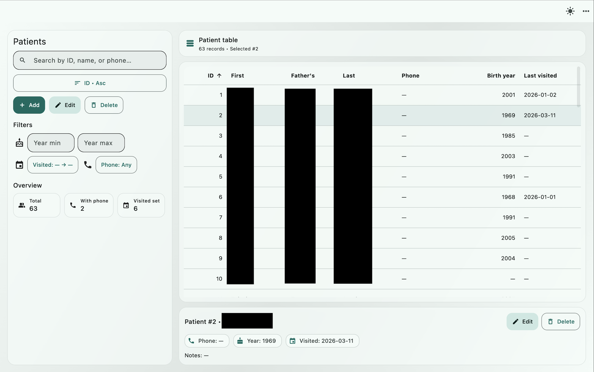

# Dr Nesrine (Flutter Desktop, Offline)

A local-only desktop app to store a simple patient list using **Flutter + SQLite**.
Works offline. Includes **search, sort, filters, add/edit/delete**, and **Export/Import DB**.



## 0) Prerequisites (macOS)
- Flutter installed and working: `flutter --version`
- Xcode installed (for macOS desktop builds): open Xcode once and accept license
- CocoaPods (usually installed automatically by Flutter/Xcode steps)

## 1) First-time setup
Unzip the project folder, then in Terminal inside it:

```bash
bash bootstrap.sh
```

This will:
- create the Flutter platform folders (macOS) **if missing**
- fetch dependencies (`flutter pub get`)

## 2) Run on macOS
```bash
flutter run -d macos
```

## 3) Build a release app (macOS)
```bash
flutter build macos --release
```

The built `.app` will be in:
`build/macos/Build/Products/Release/mama.app`

## 4) Where data is stored
The database is stored in your system app support folder, e.g.:

`~/Library/Application Support/mama/mama.db`

## 5) Backup/Restore
From the top-right menu:
- **Export/Backup DB**: choose where to save a copy of `mama.db`
- **Import/Restore DB**: select a `.db` file to replace the local DB (with confirmation)

> Tip: keep backups on an external drive.

---

If you want a Windows build later, run `flutter create --platforms=windows .` on Windows, then build there.
